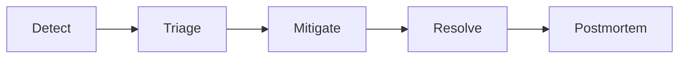

# Incident response and internal status process (DAI-53-P0-02)

Ops runbook for detecting, triaging, and resolving production incidents. Public status page is deferred to DAI-53-P3-03; this document covers **internal** process and customer comms templates.

**Related:** [saas-core-observability.md](./saas-core-observability.md), [backup-restore-drill.md](./backup-restore-drill.md), [tenant-entitlements.md](./tenant-entitlements.md), [secrets-and-rotation.md](./secrets-and-rotation.md)

**QA verification:** DAI-50 scenario **OPS-INC-01** (tabletop + postmortem).

---

## Severity definitions

| Level | Customer impact | Data / security | Response target | Examples |
|---|---|---|---|---|
| **SEV1** | Full platform outage or all tenants unable to transact | Possible data breach or active exploit | Immediate; IC within 15 min | Gateway down; DB corruption; credential leak |
| **SEV2** | Major feature degraded for many tenants | No confirmed breach | IC within 30 min | Catalog API 5xx; payment webhooks failing; entitlement mass 403 |
| **SEV3** | Limited tenant(s) or non-critical path degraded | Low risk | Business hours or next on-call | Single tenant provision stuck; reports slow |
| **SEV4** | Minor / internal only | None | Next business day | Staging drift; non-prod alert noise |

Escalate severity when impact expands or data integrity is uncertain.

---

## Roles

| Role | Responsibility |
|---|---|
| **Incident Commander (IC)** | Owns timeline, decisions, scope; delegates tasks |
| **Comms lead** | Internal updates, customer-facing messages (with PM/legal for SEV1–2) |
| **Scribe** | Timestamped incident log, action items, links to metrics/logs |
| **Subject-matter expert** | Service owner (gateway, payment, Umbraco, infra) |

On-call rotation: document primary/secondary contacts in your team wiki (not in repo). Minimum MVP: named IC backup in runbook sign-off.

---

## Lifecycle



1. **Detect** — Alert ([saas-core-observability.md](./saas-core-observability.md)), customer report, or internal discovery.
2. **Triage** — Assign SEV, IC, open internal status doc, gather correlation IDs (`X-Correlation-Id`).
3. **Mitigate** — Stop bleeding: rollback deploy, disable feature flag, scale, failover/restore per [backup-restore-drill.md](./backup-restore-drill.md).
4. **Resolve** — Root cause fixed or accepted workaround; monitors green ≥ 30 min.
5. **Postmortem** — Blameless review within 5 business days for SEV1–2; template below.

---

## Internal status updates

Create a doc (Confluence/Notion/Google Doc) at incident open. Update every **30 min** (SEV1) or **60 min** (SEV2) until resolved.

**Template:**

```text
Incident: [title]
SEV: [1-4]
Status: Investigating | Mitigating | Monitoring | Resolved
IC: [name]
Started (UTC): [timestamp]

--- Updates ---
[UTC time] [scribe] Summary of current state, customer impact, next step.
```

---

## Customer communication

Use for SEV1–2 when external tenants are affected. PM/legal review before send for data incidents.

**Initial email template:**

```text
Subject: [dCMS] Service disruption — we are investigating

We are aware of an issue affecting [describe impact: e.g. checkout, admin access].
Our team began investigation at [UTC time] and is working to restore normal service.

We will provide an update within [30/60] minutes or when we have more information.

Reference: INC-[YYYYMMDD]-[seq]
```

**Resolved email template:**

```text
Subject: [dCMS] Service restored — incident INC-[id]

The issue affecting [impact] was resolved at [UTC time].
Root cause: [brief, non-technical summary].
We are implementing [preventive actions] to reduce recurrence.

We apologize for the disruption.
```

---

## Escalation and vendor contacts

| Area | When to escalate | Runbook |
|---|---|---|
| Gateway / APIs | 5xx rate above alert threshold | [saas-core-observability.md](./saas-core-observability.md) |
| Payment webhooks | Signature failures, DLQ growth | [payment-api-security-evidence.md](./payment-api-security-evidence.md) |
| Entitlements 403 | Redis cold / subscription drift | [tenant-entitlements.md](./tenant-entitlements.md) |
| Data loss | Suspected DB corruption | [backup-restore-drill.md](./backup-restore-drill.md) |
| Secrets compromise | Leaked key in logs or repo | [secrets-and-rotation.md](./secrets-and-rotation.md) |

**Vendors (fill for your environment):**

| Vendor | Contact | Notes |
|---|---|---|
| Cloud host | | |
| Payment provider | | Dashboard + support |
| DNS / TLS | | Custom domains (P1-01) |

---

## Tabletop exercise (OPS-INC-01)

**Duration:** 30 minutes  
**Scenario:** Gateway returns 502 for all `/gateway/v1/*` routes; Umbraco backoffice still reachable.

**Facilitator script:**

1. (T+0) Alert fires: `GatewayHighErrorRate` or manual report.
2. (T+5) IC assigned; scribe opens status doc; check `GET http://localhost:5100/health` and downstream API health.
3. (T+10) Hypothesis: YARP cluster destination unhealthy — `docker compose ps`, restart `gateway` vs `catalog-api`.
4. (T+15) Mitigation: restart failing service; verify correlation smoke from observability doc.
5. (T+20) Resolve; document false root cause if drill injected failure.
6. (T+25) Fill postmortem template (below) with fictional timeline.

**Evidence:** Save notes to `docs/operations/evidence/incident-tabletop-YYYY-MM-DD.md`.

---

## Postmortem template

```markdown
# Postmortem — INC-[id]

## Summary
One paragraph: what happened, duration, customer impact.

## Timeline (UTC)
| Time | Event |
|---|---|
| | Detection |
| | IC assigned |
| | Mitigation |
| | Resolved |

## Impact
- Tenants affected:
- Duration:
- SLO breach: yes/no

## Root cause
Technical cause (5 Whys optional).

## What went well / poorly

## Action items
| Action | Owner | Due |
|---|---|---|
| | | |
```

---

## Open follow-ups

- Public status page (DAI-53-P3-03)
- PagerDuty/Opsgenie integration with alert rules in `infra/monitoring/dcms-alerts.yml`
- Webhook-specific on-call playbook (DAI-53-P1-02)
